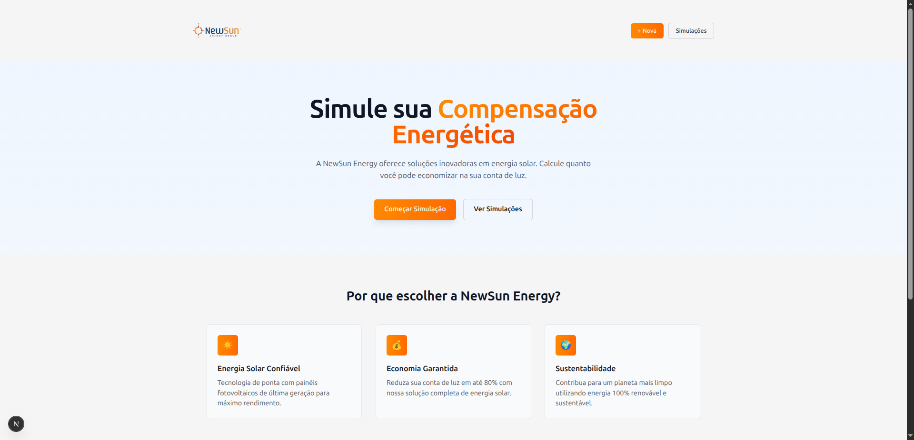
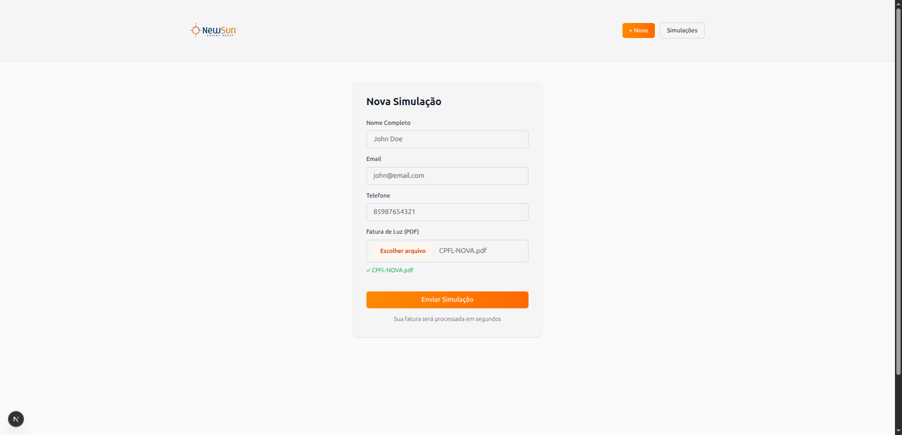
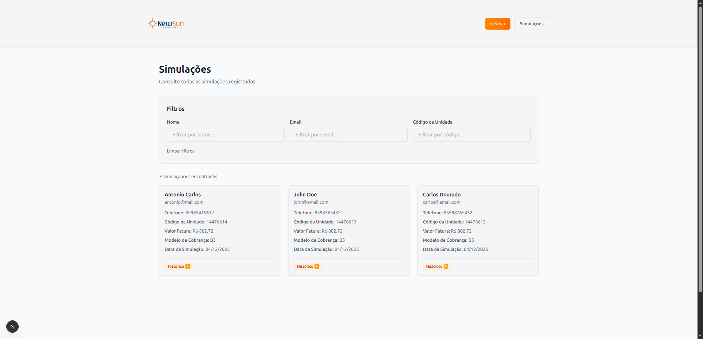
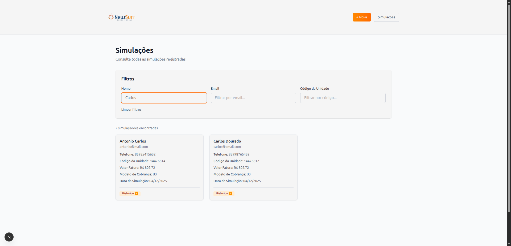
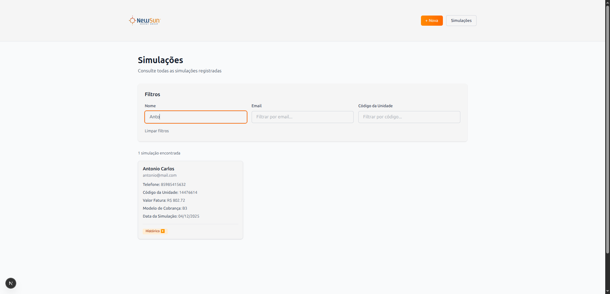
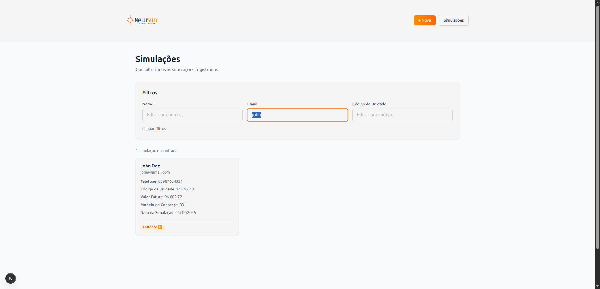
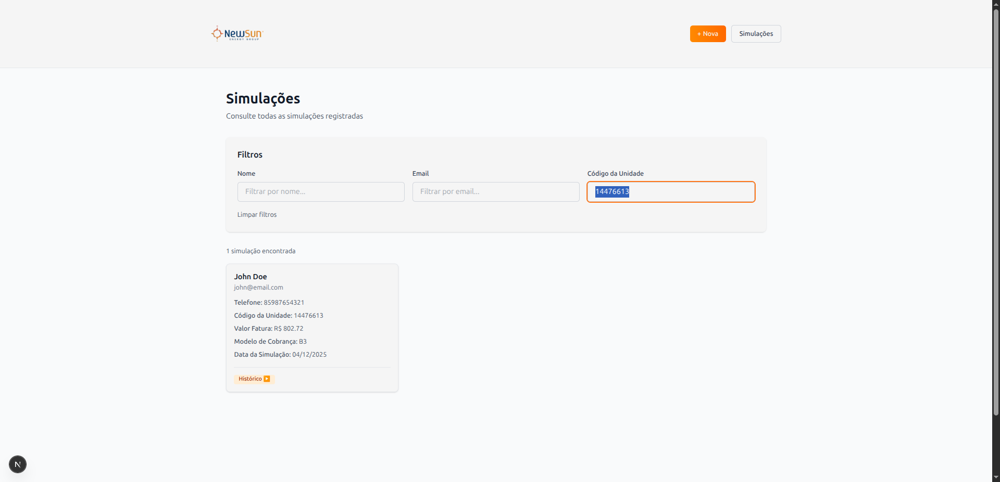

# Desafio Dev Fullstack - NewSun Energy

## 📋 Visão Geral

Aplicação fullstack para simulação de compensação energética com:

- **Backend**: NestJS + TypeORM + MySQL
- **Frontend**: Next.js 16 + React 19 + TailwindCSS
- **Infraestrutura**: Docker Compose para ambiente completo

---

## 🚀 Como Executar

### Opção 1: Com Docker (Recomendado)

#### Pré-requisitos

- Docker >= 24.0
- Docker Compose >= 2.20

#### Passo a Passo

1. **Clone o repositório**

```bash
git clone https://github.com/newsunenergy/desafio-dev-fullstack.git
cd desafio-dev-fullstack
```

2. **Suba toda a aplicação**

```bash
docker-compose up
```

3. **Aguarde o build e inicialização** (primeira execução pode levar 2-3 minutos)

   - MySQL estará pronto quando passar no healthcheck
   - Backend será inicializado após MySQL estar saudável
   - Frontend será inicializado após Backend estar saudável

4. **Acesse a aplicação**
   - Frontend: http://localhost:3000
   - Backend API: http://localhost:8080

#### Comandos Úteis

```bash
# Subir em background
docker-compose up -d

# Ver logs de todos os serviços
docker-compose logs -f

# Ver logs de um serviço específico
docker-compose logs -f backend
docker-compose logs -f frontend
docker-compose logs -f mysql

# Parar a aplicação
docker-compose down

# Remover tudo (incluindo volumes)
docker-compose down -v

# Reconstruir as imagens
docker-compose build --no-cache

# Executar comando dentro de um container
docker-compose exec backend npm run migration:run
```

---

### Opção 2: Desenvolvimento Local

#### Pré-requisitos

- Node.js 22.x ou compatível
- Docker (para subir o container com MySQL)

#### Backend

1. **Entrar na pasta backend**

```bash
cd backend
```

2. **Instalar dependências**

```bash
npm install
```

3. **Iniciar desenvolvimento (recomendado)**

```bash
npm run dev
```

Este comando executa automaticamente:

- Levanta o container Docker com MySQL
- Aguarda o MySQL estar pronto para receber consultas (via script `wait-for-mysql`)
- Aplica as migrations no banco de dados
- Inicia a aplicação em modo watch (recarrega automaticamente ao salvar arquivos)

O backend estará disponível em http://localhost:8080

**Comandos Individuais (opcional)**

Se preferir executar cada etapa separadamente:

```bash
# Levantar o container MySQL
npm run services:up

# Parar o container MySQL (sem remover)
npm run services:stop

# Parar e remover o container MySQL (também limpa volumes)
npm run services:down

# Limpar volumes do Docker (útil para resetar o banco)
npm run services:clear:volumes

# Aguardar MySQL estar pronto
npm run services:wait:database

# Gerar nova migration (após modificar entities)
npm run migration:generate

# Executar migrations manualmente
npm run migration:run

# Reverter última migration
npm run migration:revert

# Iniciar em modo watch (após todas as etapas acima)
npm run start:dev
```

**Testes**

```bash
# Testes unitários
npm test

# Testes com watch
npm run test:watch

# Coverage (cobertura de testes)
npm run test:cov

# E2E tests
npm run test:e2e
```

#### Frontend

1. **Entrar na pasta frontend**

```bash
cd frontend
```

2. **Instalar dependências**

```bash
npm install
```

3. **Iniciar em desenvolvimento**

```bash
npm run dev
```

O frontend estará disponível em http://localhost:3000

**Outros comandos**

```bash
# Build para produção
npm run build

# Iniciar aplicação compilada
npm start

# Linter (verificar e corrigir estilo de código)
npm run lint
```

---

## 📦 Estrutura do Projeto

```
desafio-dev-fullstack/
├── docker-compose.yaml          # Orquestração de containers
├── .env.docker                   # Variáveis de ambiente para Docker
│
├── backend/                      # Aplicação NestJS
│   ├── Dockerfile                # Build da aplicação backend
│   ├── .dockerignore             # Arquivos ignorados no build
│   ├── package.json
│   ├── src/
│   │   ├── leads/                # Módulo de leads
│   │   ├── pdf/                  # Módulo de parsing de PDF
│   │   ├── database/             # Configuração de banco
│   │   ├── core/                 # Filtros e erros
│   │   └── main.ts               # Entrada da aplicação
│   ├── infra/
│   │   ├── docker/
│   │   │   └── compose.yaml      # Compose para MySQL apenas (dev local)
│   │   └── scripts/
│   └── test/
│       └── app.e2e-spec.ts
│
├── frontend/                     # Aplicação Next.js
│   ├── Dockerfile                # Build da aplicação frontend
│   ├── .dockerignore             # Arquivos ignorados no build
│   ├── package.json
│   ├── app/
│   │   ├── layout.tsx            # Layout principal
│   │   ├── page.tsx              # Home page
│   │   ├── simular/              # Página de simulação
│   │   ├── listagem/             # Página de listagem
│   │   └── components/           # Componentes React
│   ├── lib/
│   │   ├── api.ts                # Cliente HTTP
│   │   ├── form-schema.ts        # Validação Zod
│   │   └── hooks/
│   └── types/
│
└── conta-de-energia/             # PDFs exemplo
```

---

## 🏗️ Arquitetura

### Backend (NestJS + TypeORM)

#### Módulos

- **LeadsModule**: Gerencia leads (simulações) com CRUD completo
- **PdfModule**: Processa uploads de contas de energia via Magic PDF API
- **DatabaseModule**: Configuração TypeORM e conexão MySQL

#### Endpoints

```
POST   /leads                 # Criar novo lead com upload de PDF
GET    /leads                 # Listar leads (com filtros)
GET    /leads/:id             # Obter lead por ID
```

#### Validação

- DTO com class-validator e class-transformer
- Filtro global de exceções (ValidationFilter)
- Validação de variáveis de ambiente com Zod

#### Testes

- **11 testes** no LeadsService
- **13 testes** no LeadsController
- **24 testes totais** com cobertura de casos de sucesso e erro

### Frontend (Next.js + React)

#### Páginas

- `/`: Home page com informações
- `/simular`: Formulário para nova simulação
- `/listagem`: Listagem de simulações com filtros

#### Tecnologias

- **React Query**: Gerenciamento de estado servidor
- **Zustand**: Gerenciamento de estado cliente
- **Zod**: Validação de schemas
- **TailwindCSS**: Estilização
- **React Hot Toast**: Notificações

---

## 📸 Demonstração das Telas

### Home Page


Página inicial com informações sobre a NewSun Energy e links para simulação.

### Formulário de Simulação


Formulário para criar nova simulação com upload de fatura em PDF.

### Listagem de Simulações


Lista de todas as simulações registradas com informações do consumo.

### Filtro por Nome



Filtragem de simulações por nome do cliente.

### Filtro por Email


Filtragem de simulações por email.

### Filtro por Unidade Consumidora


Filtragem de simulações por código da unidade consumidora.

---

## 🔧 Configuração

### Variáveis de Ambiente

#### Backend (.env.development)

```env
MYSQL_HOST=localhost
MYSQL_USER=dev_user
MYSQL_PASSWORD=dev_pass
MYSQL_DATABASE=dev_db
PORT=8080
NODE_ENV=development
FRONT_URL_DEV=http://localhost:3000
MAGIC_PDF_URL=https://magic-pdf.solarium.newsun.energy/v1/magic-pdf
```

#### Frontend (.env.local)

```env
NEXT_PUBLIC_API_URL=http://localhost:8080
```

#### Docker (.env.docker)

```env
MYSQL_HOST=mysql  # Nome do serviço Docker
NEXT_PUBLIC_API_URL=http://backend:8080  # Nome do serviço Docker
```

---

## 📊 Banco de Dados

### Schema

#### Tabela: lead

```
id (PK, UUID)
nome_completo (VARCHAR 255)
email (VARCHAR 255, UNIQUE)
telefone (VARCHAR 20)
created_at (TIMESTAMP)
updated_at (TIMESTAMP)
```

#### Tabela: unit

```
id (PK, UUID)
lead_id (FK)
codigoDaUnidadeConsumidora (VARCHAR 255, UNIQUE)
historicoDeConsumoEmKWH (JSON)
  - consumptionDate (DATE)
  - offPeakKwh (DECIMAL)
  - peakKwh (DECIMAL)
amount (DECIMAL 12,2)
barcode (VARCHAR 255)
chargingModel (VARCHAR 255)
phaseModel (VARCHAR 255)
energyCompanyId (VARCHAR 255)
leadId (UUID, FK)
createdAt (TIMESTAMP)
updatedAt (TIMESTAMP)
```

### Migrações

As migrações são executadas automaticamente ao iniciar o backend.

Para executar manualmente:

```bash
npm run migration:run
```

Para reverter última migração:

```bash
npm run migration:revert
```

---

## ✅ Validações

### Regras de Negócio

1. **Email único**: Um email pode ter apenas 1 lead
2. **Código da unidade único**: Não pode haver duplicatas
3. **Mínimo 1 unidade**: Todo lead deve ter pelo menos 1 unidade
4. **12 meses de histórico**: Cada unidade deve ter exatamente 12 meses de consumo

### Validação de Dados

- DTOs com class-validator
- Filtro global de exceções
- Mensagens de erro padronizadas
- Códigos HTTP apropriados

---

## 🧪 Testes

### Executar Testes

```bash
# Backend
cd backend

# Testes unitários
npm test

# Testes com watch
npm run test:watch

# Coverage
npm run test:cov

# E2E tests
npm run test:e2e
```

### Cobertura de Testes

**LeadsService** (11 testes)

- ✅ Criar lead com sucesso
- ✅ Validar email único
- ✅ Filtrar faturas sem consumo
- ✅ Validar mínimo de faturas
- ✅ Listar todos os leads
- ✅ Filtrar por nome
- ✅ Filtrar por email
- ✅ Filtrar por código da unidade
- ✅ Buscar lead por ID
- ✅ Lead não encontrado
- ✅ Tratamento de erros

**LeadsController** (13 testes)

- ✅ POST /leads com arquivo válido
- ✅ POST /leads sem arquivo
- ✅ POST /leads arquivo sem buffer
- ✅ GET /leads sem filtros
- ✅ GET /leads com filtro nome
- ✅ GET /leads com filtro email
- ✅ GET /leads com filtro unit code
- ✅ GET /leads com múltiplos filtros
- ✅ GET /leads resultado vazio
- ✅ GET /leads/:id encontrado
- ✅ GET /leads/:id não encontrado
- ✅ GET /leads/:id IDs diferentes
- ✅ Erros HTTP apropriados

---

## 🐳 Docker Details

### Dockerfiles (Multi-stage build)

#### Backend

- **Stage 1 (Builder)**: Compila TypeScript para JavaScript
- **Stage 2 (Runtime)**: Apenas executáveis e deps de produção
- **Image size**: ~280MB (otimizado)

#### Frontend

- **Stage 1 (Builder)**: Build Next.js otimizado
- **Stage 2 (Runtime)**: Apenas arquivos compilados
- **Image size**: ~150MB (otimizado)

### Health Checks

Todos os serviços possuem health checks configurados:

- **MySQL**: `mysqladmin ping`
- **Backend**: GET request a `/health`
- **Frontend**: GET request a `/`

Dependências entre serviços garantem startup ordenado.

---

## 📝 Diferencial

Este projeto implementa os diferenciais solicitados:

1. ✅ **Validação de dados**

   - DTOs com class-validator
   - Filtro global de exceções
   - Validação de variáveis de ambiente

2. ✅ **Docker**
   - Dockerfiles otimizados (multi-stage)
   - Docker Compose com 3 serviços
   - Health checks e dependências
   - Pronto para produção

---

## 🔗 Links Úteis

- [Repositório](https://github.com/newsunenergy/desafio-dev-fullstack)
- [Magic PDF API](https://magic-pdf.solarium.newsun.energy)
- [NestJS Docs](https://docs.nestjs.com)
- [Next.js Docs](https://nextjs.org/docs)
- [Docker Docs](https://docs.docker.com)

---

## 📧 Contato

Dúvidas ou sugestões: [paulo.santana@newsun.energy](mailto:paulo.santana@newsun.energy)

---

**Última atualização**: Dezembro 2025
